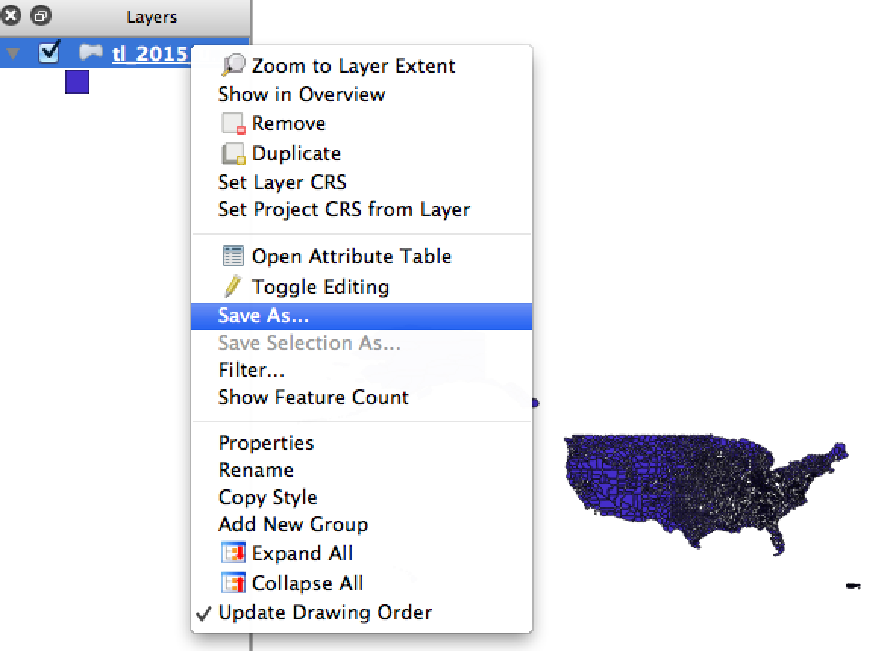

# Geographies by latitude and longitude

These are simple CSV files matching counties and ZIP code tabulation areas to their geographic centroids. While I would prefer a programmatic process, here's how I've been doing it:

+ Download the SHP file from TIGER
+ Open that SHP file in QGIS
+ Exporting the vector as a CSV, which converts just the data portion.

These files all have both a `GEOID10` column for the county or ZCTA and two rightmost fields: `INTPTLAT10` and `INTPTLON10`

Please feel free to suggest other geographic types of (better yet!) send me PRs.